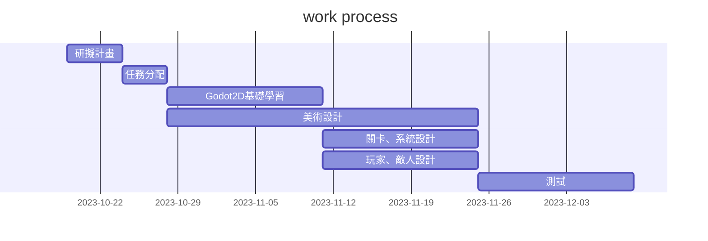
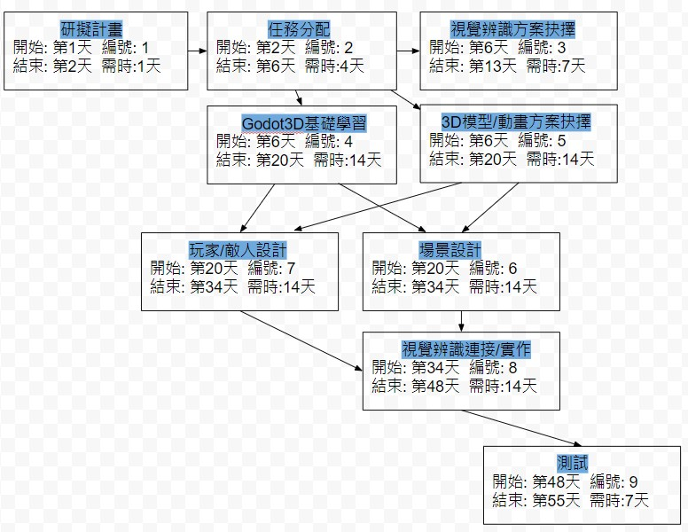

# 野生的逆襲 (｡:.ﾟヽ(>´∀`)ﾉﾟ.:｡)   

### 專題簡介 (300字以上)
```


工具：
遊戲主體在Godot上建構:
通過Godot靈活的場景系統與節點結構、
可以繼承、實例化場景的功能，
用更直觀、快速的方式組織遊戲。

程式腳本在VSCode上用C#編譯:
由於Godot本身的編譯器不夠完善，
所以使用官方推薦的VSCode以及提供的功能擴展。
```
#### 第七小組成員    
* C110118210 黃志輝(組長)  Godot3D基礎學習/玩家/敵人設計
* C110118246 戴裕桓  視覺辨識方案抉擇/連接/實作
* C110118249 林彥辰  3D模型/動畫方案抉擇
* C110118256 尤重又  Godot3D基礎學習/場景設計

### PERT/CPM 圖

## 系統需求
> * 功能性需求：
> 1. 通過攝影機傳輸畫面給Mediapipe，以此將讀取到的手部座標輸入操控角色視角。
> 2. 玩家可以使用不同的手勢召喚出不同的法術。
> 3. 玩家在關卡限定的條件(ex:時間、擊中數量)達成時，可以解鎖後續的遊戲關卡、能力等等。
> * 非功能性需求：
> 1. 反應時間：在變更手部座標後，在1/60秒內可以做出反應。
> 2. 使用性：對於一個習慣3D遊戲的玩家，在5分鐘內可以正常射擊、轉動視角，1小時內可以習慣。
> 3. 可靠度：除了玩家本身失誤之外，針對手勢偵測誤動作少於10%。
### FDD

### MRFPS的需求分析
1. 玩家可以藉由攝像頭輸入手勢到遊戲裡。
2. 玩家可以轉動視角及施放技能。
3. 遊戲內有敵人，他們會攻擊玩家。
4. 玩家必須殺死敵人。
5. 如果玩家被攻擊就會減少血量，血量歸零就會結束。
### 使用者案例圖

---
|使用者案例|MRFPS|
|:-------------:|:-------------:|
|行動者|玩家|
|說明|玩家射擊過程|
|完成動作|1. 攝像頭拍攝到玩家手部 2. 系統傳輸偵測到的手部特徵座標 3. 系統根據座標判斷射擊|
|替代方法|1. 攝像頭拍攝到玩家手部 2. 系統傳輸偵測到的手部特徵座標 3. 系統根據座標移動視角|
|先決條件|玩家要讓手部能被電腦拍攝及辨識|
|後至條件|判斷結束,下一次判斷開始|
|假設|無|
---
### Figma


### DFD


