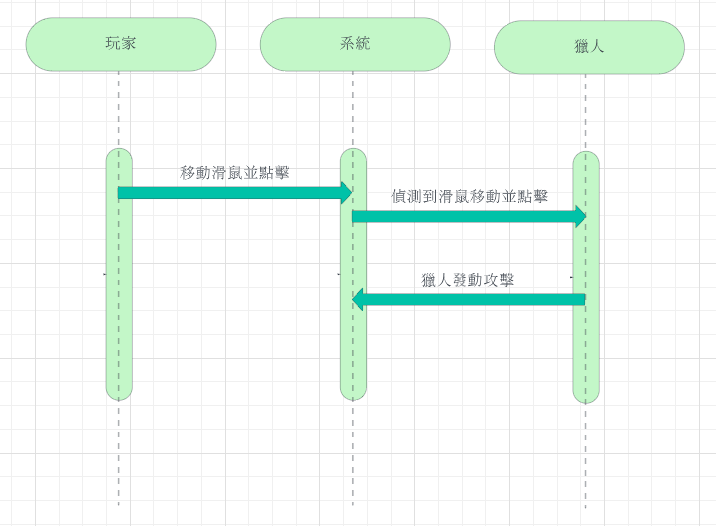

# 野生的逆襲 (｡:.ﾟヽ(>´∀`)ﾉﾟ.:｡)   

### 專題簡介 (300字以上)

```
這是一個深具挑戰性的2D射擊遊戲，玩家將扮演一名勇敢的獵人，身臨其境地探索一個充滿野生動物和驚奇的自然環境。你的任務是在這個壯麗的自然生態系統中生存、保護自己、防止自己遭受大自然的反撲,狩獵稀有動物以獲得珍貴的資源，同時保護生態平衡。

遊戲特點：

生態多樣性： 遊戲中的生態系統包括茂密的森林、湍急的河流、廣闊的草原和無垠的沙漠等，每個環境都有其獨特的動植物和挑戰。在這些生態系統中，你將遇到各種野生動物，包括獅子、狼、大象、獨角獸等。

狩獵與保護： 作為獵人，你需要平衡狩獵和保護，以確保生態平衡。狩獵野生動物以獲得資源，但也需要保護自己免受動物的反擊。你的角色將具備專業的知識和技能，以應對不同的動物和狩獵方式。

獨特的武器和工具： 你可以使用各種武器和工具，包括步槍、弓箭、陷阱、望遠鏡、追蹤設備等，以應對不同的挑戰。選擇正確的裝備將決定你在野外的生存和成功。

任務和目標： 遊戲中有各種任務和目標，包括捕獲稀有動物、研究生態系統、保護瀕危物種等。完成這些任務將解鎖更多遊戲內容。

精簡的2D圖像： 遊戲擁有令人驚嘆的2D圖像，呈現出逼真的自然風景和動物。細節和動畫效果都令人印象深刻。

故事情節： 遊戲充滿引人入勝的故事情節，你可以通過完成任務和互動來了解更多角色的背景和世界的背後故事。你的行動將影響遊戲世界的未來。

```


```


工具：
遊戲主體在Godot上建構:
通過Godot靈活的場景系統與節點結構、
可以繼承、實例化場景的功能，
用更直觀、快速的方式組織遊戲。

程式腳本在VSCode上用C#編譯:
由於Godot本身的編譯器不夠完善，
所以使用官方推薦的VSCode以及提供的功能擴展。
```
---
#### 第七小組成員 
|成員|工作|內容說明|
|:-------------:|:-------------:|:-------------:|
|C110118210 黃志輝(組長)|程式|系統、場景/關卡等設計|
|C110118246 戴裕桓|美術|UI、場景、音樂、圖示|
|C110118249 林彥辰|美術|人物、技能圖示、動畫|
|C110118256 尤重又|程式|人物、技能/道具等設計|
---

### PERT/CPM 圖

### 系統需求
> * 功能性需求：
> 1. 通過攝影機傳輸畫面給Mediapipe，以此將讀取到的手部座標輸入操控角色視角。
> 2. 玩家可以使用不同的手勢召喚出不同的法術。
> 3. 玩家在關卡限定的條件(ex:時間、擊中數量)達成時，可以解鎖後續的遊戲關卡、能力等等。
> * 非功能性需求：
> 1. 反應時間：在變更手部座標後，在1/60秒內可以做出反應。
> 2. 使用性：對於一個習慣3D遊戲的玩家，在5分鐘內可以正常射擊、轉動視角，1小時內可以習慣。
> 3. 可靠度：除了玩家本身失誤之外，針對手勢偵測誤動作少於10%。
### FDD

### MRFPS的需求分析
1. 玩家可以藉由攝像頭輸入手勢到遊戲裡。
2. 玩家可以轉動視角及施放技能。
3. 遊戲內有敵人，他們會攻擊玩家。
4. 玩家必須殺死敵人。
5. 如果玩家被攻擊就會減少血量，血量歸零就會結束。
### 使用者案例圖

---
|使用者案例|MRFPS|
|:-------------:|:-------------:|
|行動者|玩家|
|說明|玩家射擊過程|
|完成動作|1. 攝像頭拍攝到玩家手部 2. 系統傳輸偵測到的手部特徵座標 3. 系統根據座標判斷射擊|
|替代方法|1. 攝像頭拍攝到玩家手部 2. 系統傳輸偵測到的手部特徵座標 3. 系統根據座標移動視角|
|先決條件|玩家要讓手部能被電腦拍攝及辨識|
|後至條件|判斷結束,下一次判斷開始|
|假設|無|
---
### Figma


### DFD


### 類別圖


### 使用案例1


### 使用案例2


### 使用案例3


### 分鏡表


